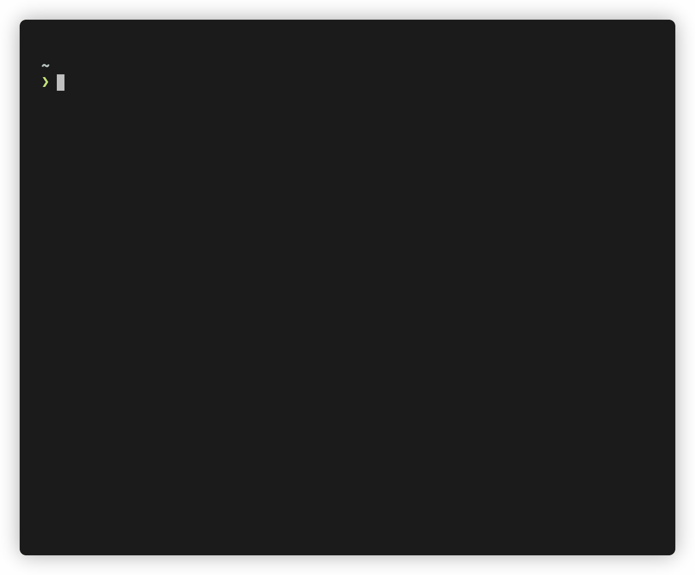

# pg_parcel



A solution to: https://postgrespro.com/list/thread-id/1715772

It's like a very minimal subset `pg_dump`, but with the addition of `mysqldump`'s `--where` option.

Most options are specified via config file.

```toml
column_name = "customer_id"
schema_name = "public"
database_url = "postgres://localhost:15432/postgres"
skip_tables = [
  "daily_exchange_rates"
]

[overrides]
# We only want the one customer identified by --id on the command line
customers = """
  select * from customers where id = :id
"""
# The `user_files` table doesn't have a customer_id column, so we need to join.
user_files = """
  select user_files.*
  from users_files
  join users on users.id = user_files.user_id
  where users.customer_id = :id
"""
```
